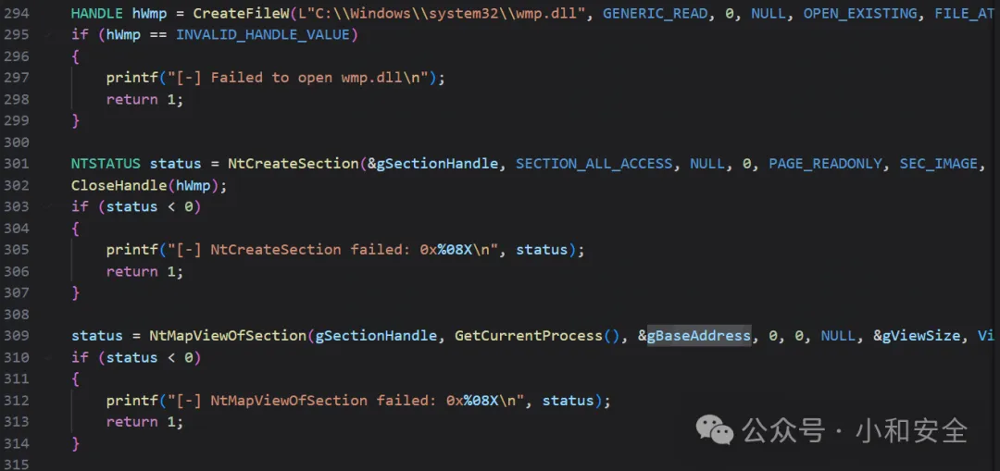
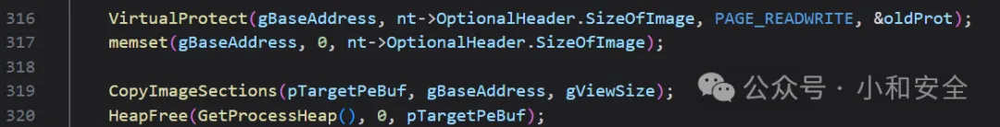
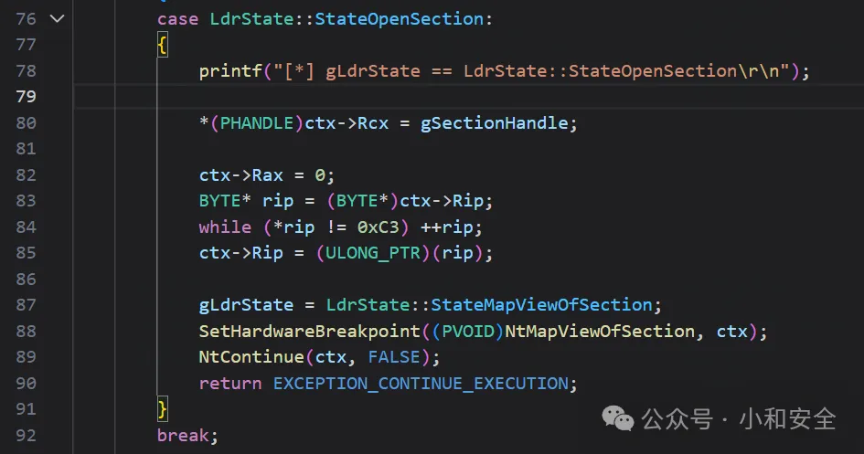
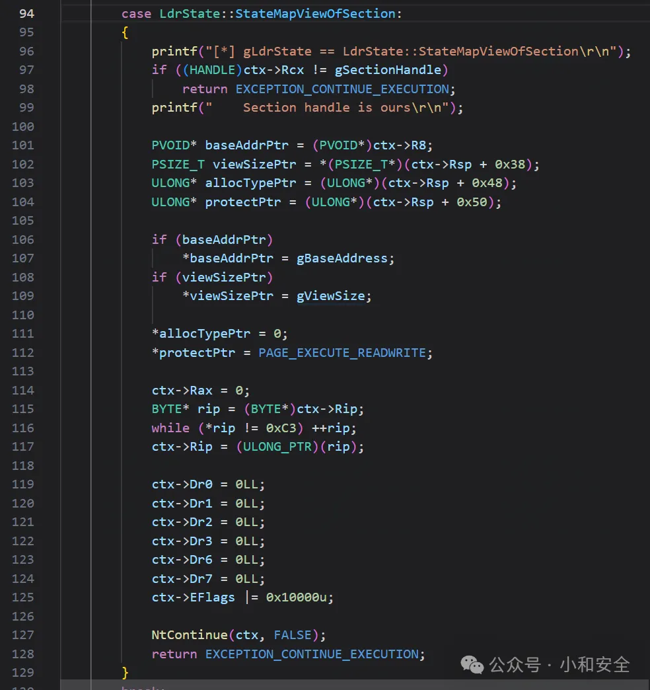
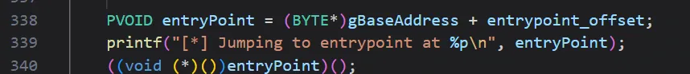
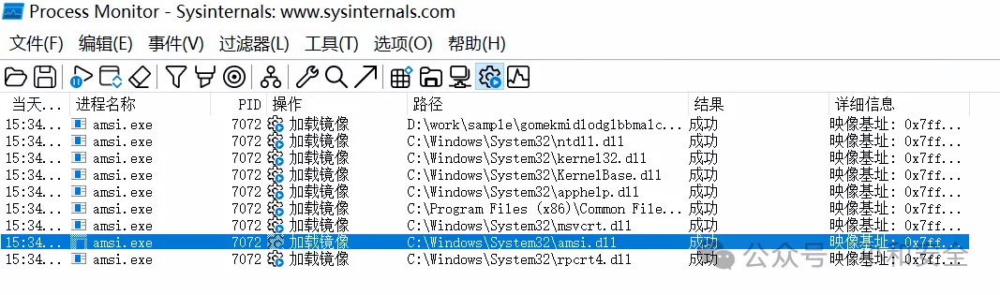
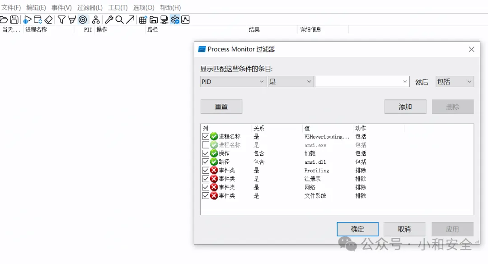
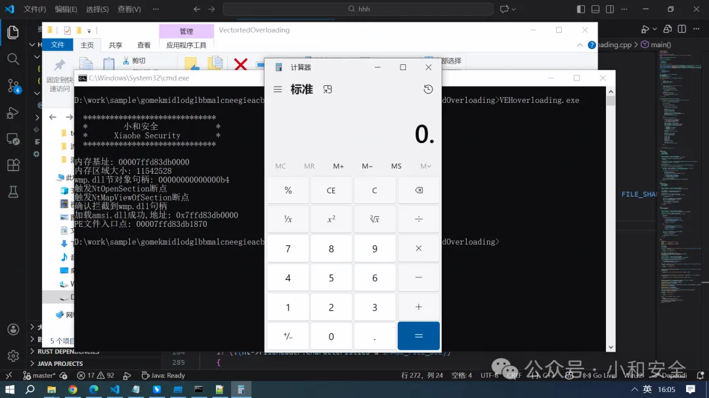

# 仓库

提供了两个示例：

（1）示例代码

VEHoverloading.c和VEHoverloading.exe只作演示使用，默认执行calc.exe，要拿来执行shellcode可以看第二个示例。

（2）真实代码

dll.c和dll.dll是源码和生成的dll，导出函数签名是`EXPORT BOOL load_vectoredoverload(LPCWSTR exePath)`，传入要执行的exe路径即可。


# 概念

硬件断点：简单来说就是在一个内存地址下断点，当CPU访问(读、写、执行)时就会触发这个断点，在这里停住，本质就是一种异常，当触发这个断点时，会触发异常处理机制(VEH)。

异常处理机制(VEH)：是一种系统级别的异常处理机制，简单来说就是告诉程序触发异常后怎么做，可以执行我们自定义的函数。

# 原理
当我们调用loadLibraryW加载一个dll到内存中时，会调用以下两个重要函数：

ZwOpenSection：打开现有节对象的句柄。

ZwMapViewOfSection：将节对象映射到内存中。

(我们在用户态调用时，应该写作NtOpenSection和NtMapViewOfSection)

### 现在就可以提出我们的思路了：

1.加载一个不常用的wmp.dll到内存中，这样可以得到一块干净的、可覆盖的内存，以及一个指向合法wmp.dll节对象的句柄。

2.用我们的恶意PE文件覆盖这块wmp.dll的内存。

3.利用loadLibraryW加载一个amsi.dll，篡改ZwOpenSection，给它返回指向合法wmp.dll节对象的句柄，再篡改ZwMapViewOfSection给它返回指向恶意PE文件的内存。

4.程序以为加载的是amsi.dll，实际上加载的是wmp.dll，而且它的内容被篡改为我们的恶意PE文件了。

5.我们在程序里面手动调用恶意代码即可，看起来像在调用合法amsi.dll一样。

# 实现

现在我们就开始一步一步实现了：

### 1.加载并篡改内存的wmp.dll：

先用CreateFileW打开wmp.dll句柄，再用NtCreateSection创建它的节对象，再用NtMapOfSection将它映射到内存中。



再用VirtualAlloc修改内存属性为可读写，然后调用memset清空它的内存内容，再写入我们的恶意PE文件(这里用calc.exe示例)。



### 2.修复并重定位恶意PE文件

我们的恶意PE文件(calc.exe)从自己的位置移到了wmp.dll的位置，相对偏移改变了，我们需要修复所有硬编码的地址，并且由于它是exe，我们需要手动修改PE头让它变成一个dll文件，并且将入口点清零，然后手动设置内存属性为可执行。

### 3.加载合法amsi.dll，并篡改为有恶意内容的wmp.dll

这里的关键是如何篡改ZwOpenSection和ZwMapViewOfSection，直接篡改太显眼容易被EDR检测，我们可以在这两个函数下硬件断点，然后自定义VEH回调函数，这样在执行到ZwOpenSection和ZwMapViewOfSection函数时触发断点，就会跳转到我们的自定义函数执行。

首先篡改ZwOpenSection函数，我们下硬件断点，执行到函数入口时，直接跳到我们的自定义VEH函数，我们直接给它返回wmp.dll的句柄，然后直接跳到ret，从而跳过ZwOpenSection的内部逻辑：



同理，程序执行到ZwCreateMapViewOfSection时，也触发断点直接跳到我们的VEH函数，我们直接给它返回恶意PE文件的地址，然后跳到ret从而跳过它的内部逻辑：



现在我们通过loadLibraryW加载的amsi.dll，其实指向的是内容为恶意PE文件的合法wmp.dll。

### 4.手动调用恶意PE文件执行

手动跳转到入口点执行即可



# 验证

我们使用如下代码，验证一下：只加载amsi.dll的时候是什么情况：

```
#include <Windows.h>
#include <stdio.h>

int main()
{
    printf("Before LoadLibraryW...\n");

    HMODULE hAmsi = LoadLibraryW(L"amsi.dll");

    if (hAmsi)
    {
        printf("amsi.dll loaded at: 0x%p\n", hAmsi);
        FreeLibrary(hAmsi);
    }
    else
    {
        printf("Failed to load amsi.dll, error: %d\n", GetLastError());
    }

    printf("Press Enter to exit...\n");
    getchar();
    return 0;
}
```

执行之后，我们看一下模块加载情况，可以看到真的加载了amsi.dll



但是我们用本文研究的技术加载一下amsi.dll，实际上我们篡改了NtOpenSection和NtMapViewOfSection，可以看见没有加载amsi.dll



执行成功，成功弹计算器


